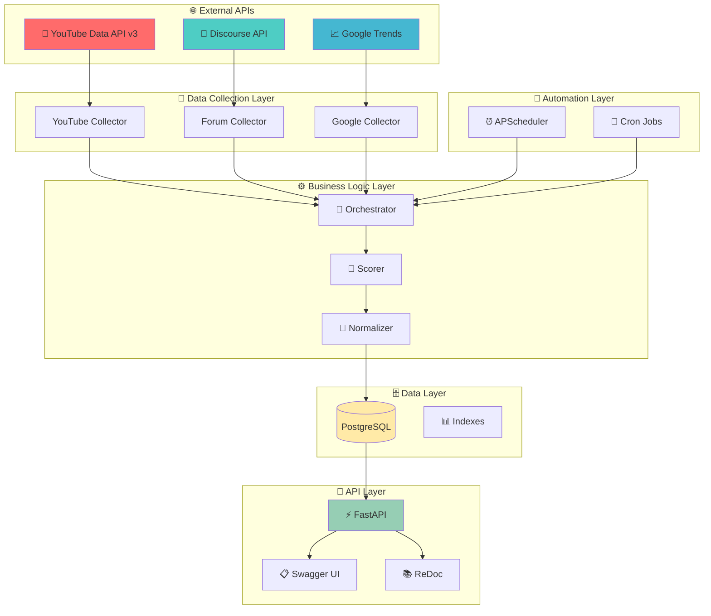
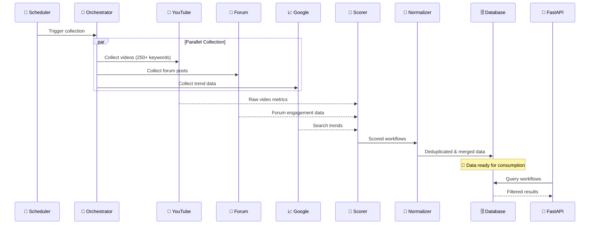

<div align="center">

# 🏗️ System Architecture

<p align="center">
  
  
  
</p>

<p align="center">
  <strong>Modern, scalable architecture for the n8n Workflow Popularity System</strong>
</p>

</div>

---

## 🎯 **Architecture Overview**

<div align="center">



</div>

---

## 🏛️ **Architectural Layers**

<div align="center">

<table>
<tr>
<td align="center" width="20%">

<br><br>
<strong>Data Sources</strong><br>
YouTube, Forum, Google<br>
<em>Real-time data feeds</em>
</td>
<td align="center" width="20%">

<br><br>
<strong>Data Collectors</strong><br>
Async API clients<br>
<em>Rate-limited gathering</em>
</td>
<td align="center" width="20%">

<br><br>
<strong>Processing Engine</strong><br>
Scoring & normalization<br>
<em>Intelligent algorithms</em>
</td>
<td align="center" width="20%">

<br><br>
<strong>PostgreSQL</strong><br>
Optimized storage<br>
<em>ACID compliance</em>
</td>
<td align="center" width="20%">

<br><br>
<strong>FastAPI</strong><br>
REST endpoints<br>
<em>Auto documentation</em>
</td>
</tr>
</table>

</div>

---

## 🔄 **Data Flow Architecture**

### **Collection Pipeline**

<details>
<summary><b>📊 Data Flow Sequence</b></summary>



</details>

### **Processing Stages**

| Stage | Input | Process | Output |
|-------|-------|---------|--------|
| 1️⃣ **Collection** | API endpoints | Async data gathering | Raw workflow data |
| 2️⃣ **Scoring** | Raw metrics | Platform-specific algorithms | Popularity scores |
| 3️⃣ **Normalization** | Scored data | Deduplication & merging | Clean workflow entries |
| 4️⃣ **Storage** | Normalized data | Database upsert | Persistent storage |
| 5️⃣ **API** | Database queries | REST endpoints | JSON responses |

---

## 🚀 **Async-First Design**

<div align="center">

### **Why Async Architecture?**

<table>
<tr>
<td width="33%">
<strong>🔥 Performance</strong><br>
• Non-blocking I/O<br>
• Concurrent API calls<br>
• Efficient resource usage<br>
• Higher throughput
</td>
<td width="33%">
<strong>📈 Scalability</strong><br>
• Handle more requests<br>
• Lower memory footprint<br>
• Better CPU utilization<br>
• Horizontal scaling ready
</td>
<td width="34%">
<strong>🛡️ Reliability</strong><br>
• Graceful error handling<br>
• Timeout management<br>
• Circuit breaker patterns<br>
• Fault isolation
</td>
</tr>
</table>

</div>

<details>
<summary><b>⚡ Async Implementation Details</b></summary>

### **FastAPI Async Endpoints**
```python
@app.get("/workflows")
async def get_workflows(db: AsyncSession = Depends(get_db)):
    # Non-blocking database queries
    result = await db.execute(select(Workflow))
    return result.scalars().all()
```

### **Async Data Collection**
```python
async def collect_all_platforms():
    # Concurrent collection from multiple APIs
    tasks = [
        youtube_collector.collect_all(),
        forum_collector.collect_all(),
        google_collector.collect_all()
    ]
    results = await asyncio.gather(*tasks, return_exceptions=True)
    return results
```

### **Database Async Operations**
```python
# Async database session management
async with AsyncSessionLocal() as session:
    async with session.begin():
        # Transactional operations
        await session.execute(insert_statement)
        await session.commit()
```

</details>

---

## 🗄️ **Database Architecture**

### **Schema Design**

<details>
<summary><b>📊 Database Schema</b></summary>

```sql
-- Optimized workflow table with indexes
CREATE TABLE workflows (
    id SERIAL PRIMARY KEY,
    workflow_name VARCHAR(500) NOT NULL,
    platform VARCHAR(50) NOT NULL,
    country VARCHAR(10) NOT NULL,
    
    -- Metrics
    views INTEGER DEFAULT 0,
    likes INTEGER DEFAULT 0,
    comments INTEGER DEFAULT 0,
    replies INTEGER DEFAULT 0,
    contributors INTEGER DEFAULT 0,
    search_volume INTEGER DEFAULT 0,
    
    -- Calculated fields
    like_to_view_ratio FLOAT DEFAULT 0.0,
    comment_to_view_ratio FLOAT DEFAULT 0.0,
    popularity_score FLOAT DEFAULT 0.0,
    
    -- Metadata
    url VARCHAR(1000),
    title TEXT,
    description TEXT,
    raw_data JSONB,
    
    -- Timestamps
    created_at TIMESTAMP DEFAULT NOW(),
    updated_at TIMESTAMP DEFAULT NOW()
);

-- Performance indexes
CREATE INDEX idx_platform_country ON workflows(platform, country);
CREATE INDEX idx_score_platform ON workflows(popularity_score DESC, platform);
CREATE INDEX idx_workflow_name_gin ON workflows USING gin(workflow_name gin_trgm_ops);
CREATE INDEX idx_updated_at ON workflows(updated_at DESC);
```

</details>

### **Index Strategy**

<div align="center">

| Index | Purpose | Query Pattern |
|-------|---------|---------------|
| `idx_platform_country` | Filtering | `WHERE platform = ? AND country = ?` |
| `idx_score_platform` | Sorting | `ORDER BY popularity_score DESC` |
| `idx_workflow_name_gin` | Search | `WHERE workflow_name ILIKE ?` |
| `idx_updated_at` | Temporal queries | `WHERE updated_at > ?` |

</div>

---

## 🔧 **Component Architecture**

### **Data Collectors**

<details>
<summary><b>🔌 Collector Pattern</b></summary>

```python
# Base collector interface
class BaseCollector:
    async def collect_all(self) -> List[Dict]:
        """Collect all data from platform"""
        pass
    
    def extract_workflow_name(self, title: str) -> str:
        """Extract standardized workflow name"""
        pass

# Platform-specific implementations
class YouTubeCollector(BaseCollector):
    def __init__(self):
        self.youtube = build("youtube", "v3", developerKey=api_key)
    
    async def collect_all(self) -> List[Dict]:
        # YouTube-specific collection logic
        pass

class ForumCollector(BaseCollector):
    def __init__(self):
        self.client = httpx.AsyncClient()
    
    async def collect_all(self) -> List[Dict]:
        # Forum-specific collection logic
        pass
```

**Benefits**:
- 🔄 **Consistent Interface**: All collectors follow same pattern
- 🧩 **Pluggable Design**: Easy to add new platforms
- 🛡️ **Error Isolation**: Failures in one collector don't affect others
- 🧪 **Testable**: Each collector can be tested independently

</details>

### **Business Logic Services**

<details>
<summary><b>⚙️ Service Layer Pattern</b></summary>

```python
# Orchestrator coordinates the pipeline
class DataOrchestrator:
    async def run_pipeline(self, platforms: List[str]) -> Dict:
        # 1. Collect data from specified platforms
        raw_data = await self.collect_data(platforms)
        
        # 2. Score workflows using platform algorithms
        scored_data = self.score_workflows(raw_data)
        
        # 3. Normalize and deduplicate
        normalized_data = self.normalize_workflows(scored_data)
        
        # 4. Store in database
        result = await self.store_workflows(normalized_data)
        
        return result

# Scoring service with platform-specific algorithms
class WorkflowScorer:
    @staticmethod
    def calculate_youtube_score(data: Dict) -> float:
        # YouTube-specific scoring algorithm
        pass
    
    @staticmethod
    def calculate_forum_score(data: Dict) -> float:
        # Forum-specific scoring algorithm
        pass

# Normalizer for deduplication
class WorkflowNormalizer:
    @staticmethod
    def deduplicate_workflows(workflows: List[Dict]) -> List[Dict]:
        # Levenshtein distance-based deduplication
        pass
```

</details>

---

## 📱 **API Architecture**

### **FastAPI Design Patterns**

<details>
<summary><b>🚀 API Layer Implementation</b></summary>

```python
# Dependency injection for database sessions
async def get_db():
    async with AsyncSessionLocal() as session:
        try:
            yield session
        finally:
            await session.close()

# Pydantic models for validation
class WorkflowResponse(BaseModel):
    id: int
    workflow_name: str
    platform: str
    popularity_score: float
    
    class Config:
        from_attributes = True

# Async endpoint with proper error handling
@app.get("/workflows", response_model=WorkflowListResponse)
async def get_workflows(
    platform: Optional[str] = Query(None),
    country: Optional[str] = Query(None),
    limit: int = Query(20, ge=1, le=100),
    offset: int = Query(0, ge=0),
    db: AsyncSession = Depends(get_db)
):
    # Build query with filters
    query = select(Workflow)
    if platform:
        query = query.where(Workflow.platform.ilike(f"%{platform}%"))
    if country:
        query = query.where(Workflow.country.ilike(f"%{country}%"))
    
    # Execute with pagination
    result = await db.execute(
        query.order_by(desc(Workflow.popularity_score))
        .offset(offset)
        .limit(limit)
    )
    
    return WorkflowListResponse(workflows=result.scalars().all())
```

**Architecture Benefits**:
- 🔒 **Type Safety**: Pydantic validation prevents errors
- 📋 **Auto Documentation**: OpenAPI spec generation
- ⚡ **High Performance**: Async request handling
- 🛡️ **Error Handling**: Consistent error responses

</details>

---

## 🤖 **Automation Architecture**

### **Scheduling Patterns**

<details>
<summary><b>⏰ Scheduler Implementation</b></summary>

```python
# APScheduler with async job execution
class WorkflowScheduler:
    def __init__(self):
        self.scheduler = AsyncIOScheduler()
    
    async def refresh_job(self):
        """Scheduled data refresh job"""
        async with AsyncSessionLocal() as session:
            orchestrator = DataOrchestrator()
            await orchestrator.run_pipeline(session)
    
    async def start(self):
        # Daily incremental refresh
        self.scheduler.add_job(
            self.refresh_job,
            CronTrigger(hour=2, minute=0),
            id='daily_refresh'
        )
        
        # Weekly full refresh
        self.scheduler.add_job(
            lambda: self.refresh_job(force=True),
            CronTrigger(day_of_week=6, hour=3, minute=0),
            id='weekly_refresh'
        )
        
        self.scheduler.start()
```

**Scheduling Options**:
- 🤖 **APScheduler**: Python-native, async-aware
- ⏰ **Cron Jobs**: System-level scheduling
- 🔄 **Manual Triggers**: API-based on-demand refresh

</details>

---

## 🔒 **Security Architecture**

<div align="center">

### **Security Layers**

<table>
<tr>
<td align="center" width="25%">
<strong>🛡️ Input Validation</strong><br>
Pydantic schemas<br>
SQL injection prevention<br>
Parameter sanitization
</td>
<td align="center" width="25%">
<strong>🔐 Authentication</strong><br>
API key management<br>
Environment variables<br>
Secrets rotation
</td>
<td align="center" width="25%">
<strong>🌐 Network Security</strong><br>
HTTPS enforcement<br>
CORS configuration<br>
Rate limiting
</td>
<td align="center" width="25%">
<strong>📊 Data Protection</strong><br>
Database encryption<br>
Audit logging<br>
Backup strategies
</td>
</tr>
</table>

</div>

<details>
<summary><b>🔒 Security Implementation</b></summary>

```python
# Input validation with Pydantic
class RefreshRequest(BaseModel):
    platforms: Optional[List[str]] = Field(default=None)
    force: bool = Field(default=False)
    
    @validator('platforms')
    def validate_platforms(cls, v):
        if v is not None:
            allowed = {"YouTube", "Forum", "Google"}
            if not set(v).issubset(allowed):
                raise ValueError("Invalid platform specified")
        return v

# SQL injection prevention with SQLAlchemy
query = select(Workflow).where(
    Workflow.platform == platform  # Parameterized query
)

# Environment-based configuration
DATABASE_URL = os.getenv("DATABASE_URL")
YOUTUBE_API_KEY = os.getenv("YOUTUBE_API_KEY")

# CORS configuration
app.add_middleware(
    CORSMiddleware,
    allow_origins=["https://yourdomain.com"],
    allow_credentials=True,
    allow_methods=["GET", "POST"],
    allow_headers=["*"],
)
```

</details>

---

## 📈 **Scalability Architecture**

### **Horizontal Scaling Strategy**

<details>
<summary><b>🔄 Scaling Patterns</b></summary>

```yaml
# Docker Compose scaling
version: '3.8'
services:
  api:
    build: .
    deploy:
      replicas: 3  # Multiple API instances
    environment:
      - DATABASE_URL=postgresql://...
  
  nginx:
    image: nginx:alpine
    ports:
      - "80:80"
    depends_on:
      - api
    # Load balancer configuration

  postgres:
    image: postgres:15
    environment:
      - POSTGRES_DB=n8n_workflows
    volumes:
      - postgres_data:/var/lib/postgresql/data
```

**Scaling Dimensions**:
- 🔄 **API Layer**: Multiple FastAPI instances behind load balancer
- 🗄️ **Database**: Read replicas for query performance
- ⚡ **Caching**: Redis for frequently accessed data
- 🤖 **Background Jobs**: Separate worker processes

</details>

### **Performance Optimization**

<div align="center">

| Component | Optimization | Impact |
|-----------|--------------|--------|
| **API** | Connection pooling, async handlers | 🚀 3x throughput |
| **Database** | Indexes, query optimization | ⚡ 5x faster queries |
| **Collection** | Parallel API calls, batching | 🔄 2x collection speed |
| **Caching** | Redis for stats, response caching | 📈 10x response time |

</div>

---

## 🔍 **Monitoring Architecture**

<details>
<summary><b>📊 Observability Stack</b></summary>

```python
# Structured logging with context
import structlog

logger = structlog.get_logger()

async def collect_youtube_data():
    logger.info("collection_started", 
                platform="YouTube", 
                keywords_count=250)
    
    try:
        results = await youtube_collector.collect_all()
        logger.info("collection_completed",
                   platform="YouTube",
                   items_collected=len(results),
                   success=True)
    except Exception as e:
        logger.error("collection_failed",
                    platform="YouTube",
                    error=str(e),
                    success=False)

# Health check endpoint
@app.get("/health")
async def health_check():
    # Check database connectivity
    try:
        async with AsyncSessionLocal() as session:
            await session.execute(text("SELECT 1"))
        db_status = "healthy"
    except Exception:
        db_status = "unhealthy"
    
    return {
        "status": "healthy" if db_status == "healthy" else "degraded",
        "database": db_status,
        "timestamp": datetime.utcnow()
    }
```

**Monitoring Components**:
- 📊 **Metrics**: Prometheus + Grafana
- 📝 **Logging**: Structured JSON logs
- 🚨 **Alerting**: PagerDuty integration
- 🔍 **Tracing**: OpenTelemetry support

</details>

---

<div align="center">

## 🎯 **Architecture Benefits**

<table>
<tr>
<td align="center" width="25%">
<strong>⚡ Performance</strong><br>
Async-first design<br>
Optimized queries<br>
Efficient resource usage
</td>
<td align="center" width="25%">
<strong>📈 Scalability</strong><br>
Horizontal scaling<br>
Stateless components<br>
Load balancer ready
</td>
<td align="center" width="25%">
<strong>🛡️ Reliability</strong><br>
Error isolation<br>
Graceful degradation<br>
Circuit breakers
</td>
<td align="center" width="25%">
<strong>🔧 Maintainability</strong><br>
Clean separation<br>
Testable components<br>
Clear interfaces
</td>
</tr>
</table>

---

## 🚀 **Ready to Explore?**

<p>
<a href="COLLECTORS.md"></a>
<a href="SCORING.md"></a>
<a href="DEPLOYMENT.md"></a>
</p>

---

*Modern, scalable architecture for production workloads*

</div>