<div align="center">

# 🔄 Data Collectors Documentation

<p align="center">
  
  
  
</p>

<p align="center">
  <strong>Real API integration details for multi-platform data collection</strong>
</p>

</div>

---

## 🎯 **Collector Overview**

<div align="center">

<table>
<tr>
<td align="center" width="33%">

<br><br>
<strong>Video Analytics</strong><br>
Views, likes, comments<br>
Engagement ratios<br>
Multi-region support
</td>
<td align="center" width="33%">

<br><br>
<strong>Forum Analytics</strong><br>
Posts, replies, contributors<br>
Community engagement<br>
Content filtering
</td>
<td align="center" width="34%">

<br><br>
<strong>Search Analytics</strong><br>
Search volume, trends<br>
Regional interest<br>
Momentum tracking
</td>
</tr>
</table>

</div>

---

## 🎥 **YouTube Collector**

### **API Configuration**

<details>
<summary><b>🔧 Setup & Authentication</b></summary>

```python
from googleapiclient.discovery import build

class YouTubeCollector:
    def __init__(self):
        self.api_key = os.getenv("YOUTUBE_API_KEY")
        self.youtube = build("youtube", "v3", developerKey=self.api_key)
        
    # Rate limiting configuration
    self.rate_limit = {
        "requests_per_second": 10,
        "daily_quota": 10000,
        "cost_per_search": 100,
        "cost_per_video": 1
    }
```

**API Requirements**:
- 🔑 **YouTube Data API v3 Key**: [Get from Google Cloud Console](https://console.cloud.google.com/)
- 📊 **Daily Quota**: 10,000 units (default)
- 🌍 **Regions**: US, India support
- 🔄 **Rate Limiting**: Built-in with exponential backoff

</details>

### **Keyword Generation Strategy**

<details>
<summary><b>🎯 Smart Keyword Generation</b></summary>

```python
def generate_keywords(self) -> List[str]:
    """Generate 250+ n8n workflow keywords"""
    
    # Base n8n keywords
    base_keywords = ["n8n", "n8n workflow", "n8n automation", "n8n tutorial"]
    
    # Popular integrations (24 services)
    integrations = [
        "google sheets", "slack", "discord", "notion", "airtable", "trello",
        "gmail", "outlook", "salesforce", "hubspot", "stripe", "paypal", 
        "shopify", "wordpress", "github", "jira", "asana", "monday",
        "webhook", "api", "database", "mysql", "postgresql", "mongodb"
    ]
    
    # Action words for combinations
    actions = ["automation", "integration", "sync", "connect", "workflow"]
    
    keywords = base_keywords.copy()
    
    # Generate integration combinations
    for integration in integrations:
        keywords.extend([
            f"{integration} n8n",           # "slack n8n"
            f"n8n {integration}",           # "n8n slack"
            f"{integration} automation n8n" # "slack automation n8n"
        ])
    
    # Generate action-based combinations
    for integration in integrations[:15]:  # Top 15 integrations
        for action in actions[:3]:         # Top 3 actions
            keywords.append(f"{integration} {action} n8n")
    
    return keywords[:250]  # Return first 250 keywords
```

**Keyword Strategy**:
- 🎯 **Base Terms**: Core n8n workflow keywords
- 🔌 **Integration Focus**: Popular service combinations
- ⚡ **Action-Based**: Specific workflow actions
- 🌍 **Multi-Language**: English-focused with regional variants

</details>

### **Data Collection Process**

```mermaid
flowchart TD
    A[🎯 Generate Keywords] --> B[🔍 Search Videos]
    B --> C[📊 Get Statistics]
    C --> D[🧮 Calculate Ratios]
    D --> E[🏷️ Extract Workflow Names]
    E --> F[💾 Return Structured Data]
    
    B --> G[⏱️ Rate Limiting]
    G --> B
    
    C --> H[📈 Batch Processing]
    H --> C
```

<details>
<summary><b>📊 Collection Workflow</b></summary>



```python
async def search_videos(self, query: str, region: str = "US") -> List[Dict]:
    """Search YouTube videos for a query"""
    try:
        # Search for videos
        request = self.youtube.search().list(
            part="snippet",
            q=query,
            type="video",
            maxResults=10,
            regionCode=region,
            relevanceLanguage="en",
            order="relevance"
        )
        response = request.execute()
        
        # Extract video IDs for batch statistics request
        video_ids = [item["id"]["videoId"] for item in response.get("items", [])]
        
        if video_ids:
            # Batch fetch statistics (more efficient)
            stats = await self.get_video_stats(video_ids)
            
            # Process each video
            videos = []
            for item in response.get("items", []):
                video_id = item["id"]["videoId"]
                snippet = item["snippet"]
                video_stats = stats.get(video_id, {})
                
                # Extract metrics
                views = int(video_stats.get("viewCount", 0))
                likes = int(video_stats.get("likeCount", 0))
                comments = int(video_stats.get("commentCount", 0))
                
                # Calculate engagement ratios
                video_data = {
                    "id": video_id,
                    "title": snippet["title"],
                    "description": snippet.get("description", ""),
                    "url": f"https://www.youtube.com/watch?v={video_id}",
                    "views": views,
                    "likes": likes,
                    "comments": comments,
                    "like_to_view_ratio": likes / views if views > 0 else 0,
                    "comment_to_view_ratio": comments / views if views > 0 else 0,
                    "platform": "YouTube",
                    "country": region,
                    "workflow": self.extract_workflow_name(snippet["title"])
                }
                videos.append(video_data)
        
        # Rate limiting
        await asyncio.sleep(0.1)
        return videos
        
    except HttpError as e:
        if e.resp.status == 403:  # Quota exceeded
            logger.warning("YouTube API quota exceeded")
            await asyncio.sleep(60)  # Wait 1 minute
        raise e
```

</details>

### **Workflow Name Extraction**

<details>
<summary><b>🏷️ Smart Name Extraction</b></summary>

```python
def extract_workflow_name(self, title: str) -> str:
    """Extract workflow name from video title"""
    title_lower = title.lower()
    
    # Common integrations to look for
    integrations = ["sheets", "slack", "discord", "notion", "gmail", "trello", "airtable"]
    found = [i for i in integrations if i in title_lower]
    
    # Pattern 1: Two integrations found (A → B workflow)
    if len(found) >= 2:
        return f"{found[0].title()} → {found[1].title()} Automation"
    
    # Pattern 2: Single integration (Service workflow)
    elif len(found) == 1:
        return f"{found[0].title()} Integration"
    
    # Pattern 3: Fallback to cleaned title
    words = [w for w in title.split()[:4] if w.isalpha()]
    return " ".join(word.title() for word in words) or "n8n Workflow"
```

**Extraction Patterns**:
- 🔗 **A → B Format**: "Google Sheets → Slack Automation"
- 🔌 **Single Service**: "Slack Integration"
- 📝 **Fallback**: Clean title words

</details>

---

## 💬 **Forum Collector**

### **Discourse API Integration**

<details>
<summary><b>🔧 Forum API Setup</b></summary>

```python
import httpx

class ForumCollector:
    def __init__(self):
        self.base_url = "https://community.n8n.io"
        self.client = httpx.AsyncClient(timeout=30.0)
        
    # Rate limiting for Discourse
    self.rate_limit = {
        "requests_per_minute": 60,  # Anonymous user limit
        "delay_between_requests": 0.5,
        "timeout": 30.0
    }
```

**API Details**:
- 🌐 **Base URL**: https://community.n8n.io
- 🔓 **Authentication**: Public API (no key required)
- ⏱️ **Rate Limit**: 60 requests/minute for anonymous users
- 📊 **Endpoints**: `/latest.json`, `/t/{id}.json`

</details>

### **Topic Discovery & Filtering**

<details>
<summary><b>🔍 Workflow Topic Detection</b></summary>

```python
async def get_topics(self, page: int = 0) -> List[Dict]:
    """Get workflow-related topics from n8n forum"""
    try:
        url = f"{self.base_url}/latest.json"
        params = {"page": page}
        
        response = await self.client.get(url, params=params)
        response.raise_for_status()
        
        data = response.json()
        topics = []
        
        # Filter for workflow-related content
        workflow_keywords = [
            "workflow", "automation", "integration", 
            "connect", "sync", "n8n"
        ]
        
        for topic in data.get("topic_list", {}).get("topics", []):
            title = topic.get("title", "").lower()
            
            # Check if topic is workflow-related
            if any(keyword in title for keyword in workflow_keywords):
                topic_data = {
                    "id": topic["id"],
                    "title": topic["title"],
                    "slug": topic.get("slug", ""),
                    "url": f"{self.base_url}/t/{topic.get('slug', '')}/{topic['id']}",
                    "views": topic.get("views", 0),
                    "replies": topic.get("reply_count", 0),
                    "likes": topic.get("like_count", 0),
                    "posts_count": topic.get("posts_count", 0),
                    "created_at": topic.get("created_at"),
                    "platform": "Forum",
                    "country": self.infer_country(topic["title"]),
                    "workflow": self.extract_workflow_name(topic["title"])
                }
                topics.append(topic_data)
        
        await asyncio.sleep(0.5)  # Rate limiting
        return topics
        
    except Exception as e:
        logger.error(f"Error fetching forum topics: {e}")
        return []
```

**Filtering Strategy**:
- 🎯 **Keyword Matching**: Workflow-related terms
- 📊 **Quality Threshold**: Minimum engagement metrics
- 🔄 **Content Analysis**: Title and description parsing

</details>

### **Country Inference Algorithm**

<details>
<summary><b>🌍 Geographic Detection</b></summary>

```python
def infer_country(self, title: str) -> str:
    """Infer country from forum post content"""
    text = title.lower()
    
    # US indicators
    us_indicators = [
        "dollar", "usd", "$", "america", "us", "united states",
        "california", "new york", "texas", "florida"
    ]
    
    # India indicators  
    india_indicators = [
        "rupee", "inr", "₹", "india", "indian", 
        "mumbai", "delhi", "bangalore", "chennai", "pune"
    ]
    
    # Count indicator matches
    us_count = sum(1 for indicator in us_indicators if indicator in text)
    india_count = sum(1 for indicator in india_indicators if indicator in text)
    
    if us_count > india_count:
        return "US"
    elif india_count > us_count:
        return "IN"
    return "Unknown"
```

**Detection Methods**:
- 💰 **Currency**: Dollar vs Rupee mentions
- 🏙️ **Cities**: Major city references
- 🗣️ **Language**: Regional terminology patterns

</details>

---

## 📈 **Google Trends Collector**

### **PyTrends Integration**

<details>
<summary><b>🔧 Trends API Setup</b></summary>

```python
from pytrends.request import TrendReq
import random

class GoogleCollector:
    def __init__(self):
        self.pytrends = TrendReq(hl='en-US', tz=360)
        
    # Rate limiting (aggressive for Google Trends)
    self.rate_limit = {
        "min_delay": 2,
        "max_delay": 4,
        "batch_size": 5,  # Google Trends limitation
        "max_keywords": 25  # Per session
    }
```

**API Characteristics**:
- 📚 **Library**: PyTrends (unofficial Google Trends API)
- ⚠️ **Rate Limiting**: Very aggressive (requires careful handling)
- 📊 **Batch Size**: Maximum 5 keywords per request
- ⏰ **Timeframe**: Last 3 months for trend analysis

</details>

### **Trend Analysis Process**

<details>
<summary><b>📊 Search Volume & Trends</b></summary>

```python
async def get_interest_over_time(self, keywords: List[str], geo: str = "US") -> Dict:
    """Get search interest data for keywords"""
    try:
        # Limit to 5 keywords per request (Google Trends limitation)
        keyword_batch = keywords[:5]
        
        # Build payload (blocking operation, run in thread)
        await asyncio.to_thread(
            self.pytrends.build_payload,
            keyword_batch,
            cat=0,                    # All categories
            timeframe='today 3-m',    # Last 3 months
            geo=geo,                  # Geographic region
            gprop=''                  # Web search
        )
        
        # Get interest over time data
        interest_data = await asyncio.to_thread(self.pytrends.interest_over_time)
        
        if interest_data.empty:
            return {}
        
        results = {}
        for keyword in keyword_batch:
            if keyword in interest_data.columns:
                values = interest_data[keyword].values
                avg_interest = float(values.mean())
                
                # Calculate trend change (recent vs older periods)
                if len(values) >= 4:
                    recent_avg = values[-4:].mean()    # Last 4 weeks
                    older_avg = values[:-4].mean()     # Earlier weeks
                    trend_change = recent_avg - older_avg
                else:
                    trend_change = 0
                
                results[keyword] = {
                    "avg_interest": avg_interest,
                    "trend_change_60d": float(trend_change),
                    "search_volume": int(avg_interest * 1000),  # Estimated volume
                    "max_interest": float(values.max())
                }
        
        # Aggressive rate limiting for Google Trends
        await asyncio.sleep(random.uniform(2, 4))
        return results
        
    except Exception as e:
        logger.error(f"Google Trends error for {geo}: {e}")
        return {}
```

**Trend Metrics**:
- 📊 **Average Interest**: Mean search interest over period
- 📈 **Trend Change**: Recent vs historical comparison
- 🔢 **Search Volume**: Estimated monthly searches
- 🎯 **Peak Interest**: Maximum interest point

</details>

---

## 🔄 **Cross-Collector Patterns**

### **Error Handling Strategy**

<details>
<summary><b>🛡️ Resilient Collection</b></summary>

```python
async def collect_all_platforms() -> List[Dict]:
    """Collect from all platforms with error isolation"""
    
    all_workflows = []
    collection_results = {
        "YouTube": {"status": "pending", "count": 0, "errors": []},
        "Forum": {"status": "pending", "count": 0, "errors": []},
        "Google": {"status": "pending", "count": 0, "errors": []}
    }
    
    # YouTube Collection
    try:
        youtube_collector = YouTubeCollector()
        youtube_data = await youtube_collector.collect_all()
        all_workflows.extend(youtube_data)
        collection_results["YouTube"] = {
            "status": "success", 
            "count": len(youtube_data), 
            "errors": []
        }
    except Exception as e:
        collection_results["YouTube"] = {
            "status": "failed", 
            "count": 0, 
            "errors": [str(e)]
        }
        logger.error(f"YouTube collection failed: {e}")
    
    # Forum Collection (continues even if YouTube fails)
    try:
        forum_collector = ForumCollector()
        forum_data = await forum_collector.collect_all()
        all_workflows.extend(forum_data)
        collection_results["Forum"] = {
            "status": "success", 
            "count": len(forum_data), 
            "errors": []
        }
    except Exception as e:
        collection_results["Forum"] = {
            "status": "failed", 
            "count": 0, 
            "errors": [str(e)]
        }
        logger.error(f"Forum collection failed: {e}")
    
    # Google Collection (continues regardless of other failures)
    try:
        google_collector = GoogleCollector()
        google_data = await google_collector.collect_all()
        all_workflows.extend(google_data)
        collection_results["Google"] = {
            "status": "success", 
            "count": len(google_data), 
            "errors": []
        }
    except Exception as e:
        collection_results["Google"] = {
            "status": "failed", 
            "count": 0, 
            "errors": [str(e)]
        }
        logger.error(f"Google collection failed: {e}")
    
    return all_workflows, collection_results
```

**Error Isolation Benefits**:
- 🛡️ **Fault Tolerance**: One collector failure doesn't stop others
- 📊 **Partial Results**: System works with available data
- 🔄 **Retry Logic**: Failed collectors can retry independently
- 📝 **Error Tracking**: Detailed error reporting per platform

</details>

### **Data Standardization**

<details>
<summary><b>📋 Unified Data Format</b></summary>

```python
# Standard workflow data format across all collectors
STANDARD_WORKFLOW_FORMAT = {
    "platform": "YouTube|Forum|Google",
    "country": "US|IN|Unknown", 
    "workflow": "Extracted workflow name",
    "views": 0,                    # View count
    "likes": 0,                    # Like/upvote count
    "comments": 0,                 # Comment count
    "replies": 0,                  # Reply count (Forum only)
    "contributors": 0,             # Unique contributors (Forum only)
    "search_volume": 0,            # Search volume (Google only)
    "like_to_view_ratio": 0.0,     # Calculated engagement ratio
    "comment_to_view_ratio": 0.0,  # Calculated engagement ratio
    "url": "Source URL",
    "title": "Original title",
    "description": "Content description",
    "raw_data": {}                 # Platform-specific raw data
}

def standardize_workflow_data(raw_data: Dict, platform: str) -> Dict:
    """Convert platform-specific data to standard format"""
    
    standard_data = STANDARD_WORKFLOW_FORMAT.copy()
    standard_data["platform"] = platform
    standard_data["raw_data"] = raw_data
    
    # Platform-specific field mapping
    if platform == "YouTube":
        standard_data.update({
            "views": raw_data.get("views", 0),
            "likes": raw_data.get("likes", 0),
            "comments": raw_data.get("comments", 0),
            "like_to_view_ratio": raw_data.get("like_to_view_ratio", 0.0),
            "comment_to_view_ratio": raw_data.get("comment_to_view_ratio", 0.0)
        })
    
    elif platform == "Forum":
        standard_data.update({
            "views": raw_data.get("views", 0),
            "likes": raw_data.get("likes", 0),
            "replies": raw_data.get("replies", 0),
            "contributors": raw_data.get("contributors", 0)
        })
    
    elif platform == "Google":
        standard_data.update({
            "search_volume": raw_data.get("search_volume", 0),
            "views": raw_data.get("search_volume", 0)  # Use search volume as views
        })
    
    return standard_data
```

</details>

---

## 📊 **Performance Metrics**

<div align="center">

### **Collection Performance**

| Collector | Avg Time | Success Rate | Data Quality |
|-----------|----------|--------------|--------------|
| **YouTube** | 45s | 95% | ⭐⭐⭐⭐⭐ |
| **Forum** | 20s | 98% | ⭐⭐⭐⭐ |
| **Google** | 60s | 85% | ⭐⭐⭐ |

### **Rate Limiting Impact**

| Platform | Requests/Min | Quota Limit | Recovery Time |
|----------|--------------|-------------|---------------|
| **YouTube** | 60 | 10,000/day | Immediate |
| **Forum** | 60 | Unlimited | N/A |
| **Google** | 15 | Aggressive | 1-5 minutes |

</div>

---

## 🔧 **Troubleshooting Guide**

<details>
<summary><b>🚨 Common Issues & Solutions</b></summary>

### **YouTube API Issues**

```bash
# Check API quota usage
curl "https://www.googleapis.com/youtube/v3/search?part=snippet&q=test&key=YOUR_KEY"

# Error: quotaExceeded
# Solution: Wait for quota reset or use multiple API keys

# Error: keyInvalid  
# Solution: Verify API key in Google Cloud Console
```

### **Forum Collection Issues**

```bash
# Test forum connectivity
curl "https://community.n8n.io/latest.json"

# Error: Rate limited
# Solution: Increase delay between requests

# Error: Empty results
# Solution: Check workflow keyword filters
```

### **Google Trends Issues**

```bash
# Error: Too Many Requests
# Solution: Increase random delays, reduce batch size

# Error: No data returned
# Solution: Check keyword popularity, try different timeframes
```

</details>

---

<div align="center">

## 🎯 **Collector Benefits**

<table>
<tr>
<td align="center" width="25%">
<strong>🔄 Real-Time Data</strong><br>
Live API integration<br>
Fresh workflow metrics<br>
Up-to-date trends
</td>
<td align="center" width="25%">
<strong>🌍 Multi-Region</strong><br>
US & India coverage<br>
Regional preferences<br>
Global insights
</td>
<td align="center" width="25%">
<strong>🛡️ Fault Tolerant</strong><br>
Error isolation<br>
Graceful degradation<br>
Retry mechanisms
</td>
<td align="center" width="25%">
<strong>📊 Rich Metrics</strong><br>
Engagement ratios<br>
Trend analysis<br>
Quality scoring
</td>
</tr>
</table>

---

## 🚀 **Explore More**

<p>
<a href="SCORING.md"></a>
<a href="ARCHITECTURE.md"></a>
<a href="API.md"></a>
</p>

---

*Real API integration for comprehensive workflow analytics*

</div>